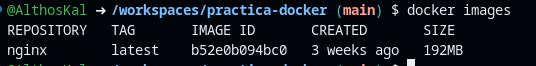

# **practica-docker**

## **Ejercicio: Trabajar con imágenes de Docker**

### **1. Extraer imagen de Docker Hub**

#### **1.1 Extraer**
Imagen a extraer: **nginx**

Comando:
```bash
docker pull nginx
```

Salida:


---

#### **1.2 Verificar**
Verificar las imágenes descargadas:

Comando:
```bash
docker images
```

Salida:


---

### **2. Ejecutar diferentes versiones de una imagen**

#### **2.1 Extraer la imagen de Python (última versión)**
Comando:
```bash
docker pull python
```

---

#### **2.2 Extraer una versión específica de Python (3.7)**
Comando:
```bash
docker pull python:3.7
```

---

#### **2.3 Listar las imágenes de Python**
Comando:
```bash
docker images python
```

Salida:


---

#### **2.4 Ejecutar contenedores con diferentes versiones**

**Última versión:**
Comando:
```bash
docker run --rm python:latest python --version
```

---

**Versión 3.7:**
Comando:
```bash
docker run --rm python:3.7 python --version
```

Salida:


---

### **3. Listado y eliminación de imágenes**

#### **3.1 Listar todas las imágenes**
Comando:
```bash
docker images
```
---

#### **3.2 Eliminar la imagen de Python 3.7**
Comando:
```bash
docker rmi python:3.7
```
---

#### **3.3 Verificar la eliminación**
Comando:
```bash
docker images python
```

Salida:


---

### **4. Comprensión de las capas de imagen**

#### **4.1 Inspeccionar las capas de la imagen Nginx**
Comando:
```bash
docker inspect --format='{{.RootFS.Layers}}' nginx
```

Salida:


---

#### **4.2 Crear una imagen personalizada**
1. Crear un archivo `Dockerfile` con el siguiente contenido:
   ```Dockerfile
   FROM nginx
   RUN echo "Hello from custom layer" > /usr/share/nginx/html/hello.html
   ```
   **El Dockerfile está presente en este repositorio**

2. Construir la imagen personalizada:
   ```bash
   docker build -t custom-nginx .
   ```

3. Inspeccionar las capas de la imagen personalizada:
   ```bash
   docker inspect --format='{{.RootFS.Layers}}' custom-nginx
   ```

Salida:


---

### **5. Búsqueda de imágenes en Docker Hub**

#### **5.1 Buscar imágenes de Nginx**
Comando:
```bash
docker search nginx
```

Salida:

---

#### **5.2 Buscar imágenes de Python**
Comando:
```bash
docker search python
```

Salida:


---

### **6. Guardar y cargar imágenes**

#### **6.1 Guardar la imagen de Nginx en un archivo**
Comando:
```bash
docker save nginx > nginx.tar
```

---

#### **6.2 Eliminar la imagen de Nginx**
Comando:
```bash
docker rmi nginx
```

---

#### **6.3 Cargar la imagen desde el archivo**
Comando:
```bash
docker load < nginx.tar
```

---

#### **6.4 Verificar la carga**
Comando:
```bash
docker images nginx
```

Salida:


---

### **7. Etiquetado básico de imágenes**

#### **7.1 Crear una nueva etiqueta para la imagen de Nginx**
Comando:
```bash
docker tag nginx:latest my-nginx:v1
```

---

#### **7.2 Listar las imágenes para ver la nueva etiqueta**
Comando:
```bash
docker images
```

---

#### **7.3 Ejecutar un contenedor con la nueva etiqueta**
Comando:
```bash
docker run -d --name my-nginx-container my-nginx:v1
```

---

#### **7.4 Verificar el contenedor en ejecución**
Comando:
```bash
docker ps
```

Salida:


---

## **Ejercicio: Gestión de Contenedores**

### **1. Ejecución de contenedores en diferentes modos**

#### **1.1 Ejecutar un contenedor en modo separado (detached)**
Comando:
```bash
docker run -d --name nginx-detached nginx
```

---

#### **1.2 Verificar el estado del contenedor**
Comando:
```bash
docker ps
```

---

#### **1.3 Ejecutar un contenedor en modo interactivo**
Comando:
```bash
docker run -it --name ubuntu-interactive ubuntu /bin/bash
```

---

#### **1.4 Listar todos los contenedores (incluyendo los detenidos)**
Comando:
```bash
docker ps -a
```

Salida:


---

### **2. Gestión del ciclo de vida de los contenedores**

#### **2.1 Detener un contenedor**
Comando:
```bash
docker stop nginx-detached
```

---

#### **2.2 Verificar el estado del contenedor**
Comando:
```bash
docker ps -a
```

---

#### **2.3 Iniciar un contenedor detenido**
Comando:
```bash
docker start nginx-detached
```

---

#### **2.4 Reiniciar un contenedor**
Comando:
```bash
docker restart nginx-detached
```

---

#### **2.5 Eliminar un contenedor detenido**
Comando:
```bash
docker rm ubuntu-interactive
```

Salida:


---

### **3. Inspección de los detalles del contenedor**

#### **3.1 Inspeccionar un contenedor**
Comando:
```bash
docker inspect nginx-detached
```

Salida:
```bash
@AlthosKal ➜ /workspaces/practica-docker (main) $ docker inspect nginx-detached
[
    {
        "Id": "19187f76d998ade327d74d71ee8eaeb0f6c6ea1f63261054466320aacb10adf5",
        "Created": "2025-03-03T19:10:38.859929758Z",
        "Path": "/docker-entrypoint.sh",
        "Args": [
            "nginx",
            "-g",
            "daemon off;"
        ],
        "State": {
            "Status": "running",
            "Running": true,
            "Paused": false,
            "Restarting": false,
            "OOMKilled": false,
            "Dead": false,
            "Pid": 43880,
            "ExitCode": 0,
            "Error": "",
            "StartedAt": "2025-03-03T19:14:12.526073858Z",
            "FinishedAt": "2025-03-03T19:14:12.35235287Z"
        },
        "Image": "sha256:b52e0b094bc0e26c9eddc9e4ab7a64ce0033c3360d8b7ad4ff4132c4e03e8f7b",
        "ResolvConfPath": "/var/lib/docker/containers/19187f76d998ade327d74d71ee8eaeb0f6c6ea1f63261054466320aacb10adf5/resolv.conf",
        "HostnamePath": "/var/lib/docker/containers/19187f76d998ade327d74d71ee8eaeb0f6c6ea1f63261054466320aacb10adf5/hostname",
        "HostsPath": "/var/lib/docker/containers/19187f76d998ade327d74d71ee8eaeb0f6c6ea1f63261054466320aacb10adf5/hosts",
        "LogPath": "/var/lib/docker/containers/19187f76d998ade327d74d71ee8eaeb0f6c6ea1f63261054466320aacb10adf5/19187f76d998ade327d74d71ee8eaeb0f6c6ea1f63261054466320aacb10adf5-json.log",
        "Name": "/nginx-detached",
        "RestartCount": 0,
        "Driver": "overlay2",
        "Platform": "linux",
        "MountLabel": "",
        "ProcessLabel": "",
        "AppArmorProfile": "docker-default",
        "ExecIDs": null,
        "HostConfig": {
            "Binds": null,
            "ContainerIDFile": "",
            "LogConfig": {
                "Type": "json-file",
                "Config": {}
            },
            "NetworkMode": "bridge",
            "PortBindings": {},
            "RestartPolicy": {
                "Name": "no",
                "MaximumRetryCount": 0
            },
            "AutoRemove": false,
            "VolumeDriver": "",
            "VolumesFrom": null,
            "ConsoleSize": [
                13,
                229
            ],
            "CapAdd": null,
            "CapDrop": null,
            "CgroupnsMode": "private",
            "Dns": [],
            "DnsOptions": [],
            "DnsSearch": [],
            "ExtraHosts": null,
            "GroupAdd": null,
            "IpcMode": "private",
            "Cgroup": "",
            "Links": null,
            "OomScoreAdj": 0,
            "PidMode": "",
            "Privileged": false,
            "PublishAllPorts": false,
            "ReadonlyRootfs": false,
            "SecurityOpt": null,
            "UTSMode": "",
            "UsernsMode": "",
            "ShmSize": 67108864,
            "Runtime": "runc",
            "Isolation": "",
            "CpuShares": 0,
            "Memory": 0,
            "NanoCpus": 0,
            "CgroupParent": "",
            "BlkioWeight": 0,
            "BlkioWeightDevice": [],
            "BlkioDeviceReadBps": [],
            "BlkioDeviceWriteBps": [],
            "BlkioDeviceReadIOps": [],
            "BlkioDeviceWriteIOps": [],
            "CpuPeriod": 0,
            "CpuQuota": 0,
            "CpuRealtimePeriod": 0,
            "CpuRealtimeRuntime": 0,
            "CpusetCpus": "",
            "CpusetMems": "",
            "Devices": [],
            "DeviceCgroupRules": null,
            "DeviceRequests": null,
            "MemoryReservation": 0,
            "MemorySwap": 0,
            "MemorySwappiness": null,
            "OomKillDisable": null,
            "PidsLimit": null,
            "Ulimits": [],
            "CpuCount": 0,
            "CpuPercent": 0,
            "IOMaximumIOps": 0,
            "IOMaximumBandwidth": 0,
            "MaskedPaths": [
                "/proc/asound",
                "/proc/acpi",
                "/proc/kcore",
                "/proc/keys",
                "/proc/latency_stats",
                "/proc/timer_list",
                "/proc/timer_stats",
                "/proc/sched_debug",
                "/proc/scsi",
                "/sys/firmware",
                "/sys/devices/virtual/powercap"
            ],
            "ReadonlyPaths": [
                "/proc/bus",
                "/proc/fs",
                "/proc/irq",
                "/proc/sys",
                "/proc/sysrq-trigger"
            ]
        },
        "GraphDriver": {
            "Data": {
                "LowerDir": "/var/lib/docker/overlay2/c6a5c81aef345271a9e6072a4d4f9120f93e49189e591ddb7cac151fa2fc428d-init/diff:/var/lib/docker/overlay2/274da2f46155cc2e0a00e2f03418ea8e2fc355627fb2b6f62e00100679b51764/diff:/var/lib/docker/overlay2/7921d90111dafd01be779d2b09d04d5406968b2c1f67f3d60d2a86c1241eedef/diff:/var/lib/docker/overlay2/9efebc4f1d04f8e3f2adda6893cfebfbeb18e32e6a779433dea00fb31d3a9073/diff:/var/lib/docker/overlay2/fe32cefc3aef9e08f815426be9f6ad04739efca9841320ecb0254624b7ab07b2/diff:/var/lib/docker/overlay2/23b6ca68119f851a687b777d304abecf23b38c28cbf74e753a5c0aefddb0a4f8/diff:/var/lib/docker/overlay2/9a5a90d0d914cc1d21134f29e4353dd61d56002a7941bca7c82f305d77c186e7/diff:/var/lib/docker/overlay2/c3c2db59d4da21fa339994094f96fafa36111a34a9e91c3b0fe30c74f946904b/diff",
                "MergedDir": "/var/lib/docker/overlay2/c6a5c81aef345271a9e6072a4d4f9120f93e49189e591ddb7cac151fa2fc428d/merged",
                "UpperDir": "/var/lib/docker/overlay2/c6a5c81aef345271a9e6072a4d4f9120f93e49189e591ddb7cac151fa2fc428d/diff",
                "WorkDir": "/var/lib/docker/overlay2/c6a5c81aef345271a9e6072a4d4f9120f93e49189e591ddb7cac151fa2fc428d/work"
            },
            "Name": "overlay2"
        },
        "Mounts": [],
        "Config": {
            "Hostname": "19187f76d998",
            "Domainname": "",
            "User": "",
            "AttachStdin": false,
            "AttachStdout": false,
            "AttachStderr": false,
            "ExposedPorts": {
                "80/tcp": {}
            },
            "Tty": false,
            "OpenStdin": false,
            "StdinOnce": false,
            "Env": [
                "PATH=/usr/local/sbin:/usr/local/bin:/usr/sbin:/usr/bin:/sbin:/bin",
                "NGINX_VERSION=1.27.4",
                "NJS_VERSION=0.8.9",
                "NJS_RELEASE=1~bookworm",
                "PKG_RELEASE=1~bookworm",
                "DYNPKG_RELEASE=1~bookworm"
            ],
            "Cmd": [
                "nginx",
                "-g",
                "daemon off;"
            ],
            "Image": "nginx",
            "Volumes": null,
            "WorkingDir": "",
            "Entrypoint": [
                "/docker-entrypoint.sh"
            ],
            "OnBuild": null,
            "Labels": {
                "maintainer": "NGINX Docker Maintainers <docker-maint@nginx.com>"
            },
            "StopSignal": "SIGQUIT"
        },
        "NetworkSettings": {
            "Bridge": "",
            "SandboxID": "df82836f738b50eb700c26b9410666f151d3bd4ec4fecde32aca590b59f11ace",
            "SandboxKey": "/var/run/docker/netns/df82836f738b",
            "Ports": {
                "80/tcp": null
            },
            "HairpinMode": false,
            "LinkLocalIPv6Address": "",
            "LinkLocalIPv6PrefixLen": 0,
            "SecondaryIPAddresses": null,
            "SecondaryIPv6Addresses": null,
            "EndpointID": "a560df1d20845e01a9dfc2aba6afb32d91b0cd87a4cf5daacbff1e55a2ec0775",
            "Gateway": "172.17.0.1",
            "GlobalIPv6Address": "",
            "GlobalIPv6PrefixLen": 0,
            "IPAddress": "172.17.0.3",
            "IPPrefixLen": 16,
            "IPv6Gateway": "",
            "MacAddress": "02:42:ac:11:00:03",
            "Networks": {
                "bridge": {
                    "IPAMConfig": null,
                    "Links": null,
                    "Aliases": null,
                    "MacAddress": "02:42:ac:11:00:03",
                    "DriverOpts": null,
                    "NetworkID": "7918ed067efd264502a41f6825b653a71ca27e0c476489cf30ac916042613dca",
                    "EndpointID": "a560df1d20845e01a9dfc2aba6afb32d91b0cd87a4cf5daacbff1e55a2ec0775",
                    "Gateway": "172.17.0.1",
                    "IPAddress": "172.17.0.3",
                    "IPPrefixLen": 16,
                    "IPv6Gateway": "",
                    "GlobalIPv6Address": "",
                    "GlobalIPv6PrefixLen": 0,
                    "DNSNames": null
                }
            }
        }
    }
]
```

---

#### **3.2 Obtener la dirección IP del contenedor**
Comando:
```bash
docker inspect -f '{{range .NetworkSettings.Networks}}{{.IPAddress}}{{end}}' nginx-detached
```

---

#### **3.3 Verificar el estado del contenedor**
Comando:
```bash
docker inspect -f '{{.State.Status}}' nginx-detached
```

---

#### **3.4 Mapear puertos en un contenedor**
Comando:
```bash
docker run -d --name nginx-with-port -p 8080:80 nginx
```

---

#### **3.5 Verificar el mapeo de puertos**
Comando:
```bash
docker port nginx-with-port
```

Salida:


---

### **4. Trabajar con registros de contenedores**

#### **4.1 Ver los registros de un contenedor**
Comando:
```bash
docker logs nginx-detached
```

Salida:
```bash
@AlthosKal ➜ /workspaces/practica-docker (main) $ docker logs nginx-detached
/docker-entrypoint.sh: /docker-entrypoint.d/ is not empty, will attempt to perform configuration
/docker-entrypoint.sh: Looking for shell scripts in /docker-entrypoint.d/
/docker-entrypoint.sh: Launching /docker-entrypoint.d/10-listen-on-ipv6-by-default.sh
10-listen-on-ipv6-by-default.sh: info: Getting the checksum of /etc/nginx/conf.d/default.conf
10-listen-on-ipv6-by-default.sh: info: Enabled listen on IPv6 in /etc/nginx/conf.d/default.conf
/docker-entrypoint.sh: Sourcing /docker-entrypoint.d/15-local-resolvers.envsh
/docker-entrypoint.sh: Launching /docker-entrypoint.d/20-envsubst-on-templates.sh
/docker-entrypoint.sh: Launching /docker-entrypoint.d/30-tune-worker-processes.sh
/docker-entrypoint.sh: Configuration complete; ready for start up
2025/03/03 19:10:39 [notice] 1#1: using the "epoll" event method
2025/03/03 19:10:39 [notice] 1#1: nginx/1.27.4
2025/03/03 19:10:39 [notice] 1#1: built by gcc 12.2.0 (Debian 12.2.0-14) 
2025/03/03 19:10:39 [notice] 1#1: OS: Linux 6.5.0-1025-azure
2025/03/03 19:10:39 [notice] 1#1: getrlimit(RLIMIT_NOFILE): 1048576:1048576
2025/03/03 19:10:39 [notice] 1#1: start worker processes
2025/03/03 19:10:39 [notice] 1#1: start worker process 29
2025/03/03 19:10:39 [notice] 1#1: start worker process 30
2025/03/03 19:13:31 [notice] 1#1: signal 3 (SIGQUIT) received, shutting down
2025/03/03 19:13:31 [notice] 30#30: gracefully shutting down
2025/03/03 19:13:31 [notice] 29#29: gracefully shutting down
2025/03/03 19:13:31 [notice] 29#29: exiting
2025/03/03 19:13:31 [notice] 30#30: exiting
2025/03/03 19:13:31 [notice] 29#29: exit
2025/03/03 19:13:31 [notice] 30#30: exit
2025/03/03 19:13:31 [notice] 1#1: signal 17 (SIGCHLD) received from 30
2025/03/03 19:13:31 [notice] 1#1: worker process 30 exited with code 0
2025/03/03 19:13:31 [notice] 1#1: signal 29 (SIGIO) received
2025/03/03 19:13:31 [notice] 1#1: signal 17 (SIGCHLD) received from 29
2025/03/03 19:13:31 [notice] 1#1: worker process 29 exited with code 0
2025/03/03 19:13:31 [notice] 1#1: exit
/docker-entrypoint.sh: /docker-entrypoint.d/ is not empty, will attempt to perform configuration
/docker-entrypoint.sh: Looking for shell scripts in /docker-entrypoint.d/
/docker-entrypoint.sh: Launching /docker-entrypoint.d/10-listen-on-ipv6-by-default.sh
10-listen-on-ipv6-by-default.sh: info: IPv6 listen already enabled
/docker-entrypoint.sh: Sourcing /docker-entrypoint.d/15-local-resolvers.envsh
/docker-entrypoint.sh: Launching /docker-entrypoint.d/20-envsubst-on-templates.sh
/docker-entrypoint.sh: Launching /docker-entrypoint.d/30-tune-worker-processes.sh
/docker-entrypoint.sh: Configuration complete; ready for start up
2025/03/03 19:14:00 [notice] 1#1: using the "epoll" event method
2025/03/03 19:14:00 [notice] 1#1: nginx/1.27.4
2025/03/03 19:14:00 [notice] 1#1: built by gcc 12.2.0 (Debian 12.2.0-14) 
2025/03/03 19:14:00 [notice] 1#1: OS: Linux 6.5.0-1025-azure
2025/03/03 19:14:00 [notice] 1#1: getrlimit(RLIMIT_NOFILE): 1048576:1048576
2025/03/03 19:14:00 [notice] 1#1: start worker processes
2025/03/03 19:14:00 [notice] 1#1: start worker process 22
2025/03/03 19:14:00 [notice] 1#1: start worker process 23
2025/03/03 19:14:12 [notice] 1#1: signal 3 (SIGQUIT) received, shutting down
2025/03/03 19:14:12 [notice] 22#22: gracefully shutting down
2025/03/03 19:14:12 [notice] 22#22: exiting
2025/03/03 19:14:12 [notice] 22#22: exit
2025/03/03 19:14:12 [notice] 23#23: gracefully shutting down
2025/03/03 19:14:12 [notice] 23#23: exiting
2025/03/03 19:14:12 [notice] 23#23: exit
2025/03/03 19:14:12 [notice] 1#1: signal 17 (SIGCHLD) received from 22
2025/03/03 19:14:12 [notice] 1#1: worker process 22 exited with code 0
2025/03/03 19:14:12 [notice] 1#1: signal 29 (SIGIO) received
2025/03/03 19:14:12 [notice] 1#1: signal 17 (SIGCHLD) received from 23
2025/03/03 19:14:12 [notice] 1#1: worker process 23 exited with code 0
2025/03/03 19:14:12 [notice] 1#1: exit
/docker-entrypoint.sh: /docker-entrypoint.d/ is not empty, will attempt to perform configuration
/docker-entrypoint.sh: Looking for shell scripts in /docker-entrypoint.d/
/docker-entrypoint.sh: Launching /docker-entrypoint.d/10-listen-on-ipv6-by-default.sh
10-listen-on-ipv6-by-default.sh: info: IPv6 listen already enabled
/docker-entrypoint.sh: Sourcing /docker-entrypoint.d/15-local-resolvers.envsh
/docker-entrypoint.sh: Launching /docker-entrypoint.d/20-envsubst-on-templates.sh
/docker-entrypoint.sh: Launching /docker-entrypoint.d/30-tune-worker-processes.sh
/docker-entrypoint.sh: Configuration complete; ready for start up
2025/03/03 19:14:12 [notice] 1#1: using the "epoll" event method
2025/03/03 19:14:12 [notice] 1#1: nginx/1.27.4
2025/03/03 19:14:12 [notice] 1#1: built by gcc 12.2.0 (Debian 12.2.0-14) 
2025/03/03 19:14:12 [notice] 1#1: OS: Linux 6.5.0-1025-azure
2025/03/03 19:14:12 [notice] 1#1: getrlimit(RLIMIT_NOFILE): 1048576:1048576
2025/03/03 19:14:12 [notice] 1#1: start worker processes
2025/03/03 19:14:12 [notice] 1#1: start worker process 22
2025/03/03 19:14:12 [notice] 1#1: start worker process 23
```

---

#### **4.2 Ver las últimas 10 líneas de los registros**
Comando:
```bash
docker logs --tail 10 nginx-detached
```

Salida:


---

#### **4.3 Seguir los registros en tiempo real**
Comando:
```bash
docker logs -f nginx-detached
```

Salida:
```bash
@AlthosKal ➜ /workspaces/practica-docker (main) $ docker logs -f nginx-detached
/docker-entrypoint.sh: /docker-entrypoint.d/ is not empty, will attempt to perform configuration
/docker-entrypoint.sh: Looking for shell scripts in /docker-entrypoint.d/
/docker-entrypoint.sh: Launching /docker-entrypoint.d/10-listen-on-ipv6-by-default.sh
10-listen-on-ipv6-by-default.sh: info: Getting the checksum of /etc/nginx/conf.d/default.conf
10-listen-on-ipv6-by-default.sh: info: Enabled listen on IPv6 in /etc/nginx/conf.d/default.conf
/docker-entrypoint.sh: Sourcing /docker-entrypoint.d/15-local-resolvers.envsh
/docker-entrypoint.sh: Launching /docker-entrypoint.d/20-envsubst-on-templates.sh
/docker-entrypoint.sh: Launching /docker-entrypoint.d/30-tune-worker-processes.sh
/docker-entrypoint.sh: Configuration complete; ready for start up
2025/03/03 19:10:39 [notice] 1#1: using the "epoll" event method
2025/03/03 19:10:39 [notice] 1#1: nginx/1.27.4
2025/03/03 19:10:39 [notice] 1#1: built by gcc 12.2.0 (Debian 12.2.0-14) 
2025/03/03 19:10:39 [notice] 1#1: OS: Linux 6.5.0-1025-azure
2025/03/03 19:10:39 [notice] 1#1: getrlimit(RLIMIT_NOFILE): 1048576:1048576
2025/03/03 19:10:39 [notice] 1#1: start worker processes
2025/03/03 19:10:39 [notice] 1#1: start worker process 29
2025/03/03 19:10:39 [notice] 1#1: start worker process 30
2025/03/03 19:13:31 [notice] 1#1: signal 3 (SIGQUIT) received, shutting down
2025/03/03 19:13:31 [notice] 30#30: gracefully shutting down
2025/03/03 19:13:31 [notice] 29#29: gracefully shutting down
2025/03/03 19:13:31 [notice] 29#29: exiting
2025/03/03 19:13:31 [notice] 30#30: exiting
2025/03/03 19:13:31 [notice] 29#29: exit
2025/03/03 19:13:31 [notice] 30#30: exit
2025/03/03 19:13:31 [notice] 1#1: signal 17 (SIGCHLD) received from 30
2025/03/03 19:13:31 [notice] 1#1: worker process 30 exited with code 0
2025/03/03 19:13:31 [notice] 1#1: signal 29 (SIGIO) received
2025/03/03 19:13:31 [notice] 1#1: signal 17 (SIGCHLD) received from 29
2025/03/03 19:13:31 [notice] 1#1: worker process 29 exited with code 0
2025/03/03 19:13:31 [notice] 1#1: exit
/docker-entrypoint.sh: /docker-entrypoint.d/ is not empty, will attempt to perform configuration
/docker-entrypoint.sh: Looking for shell scripts in /docker-entrypoint.d/
/docker-entrypoint.sh: Launching /docker-entrypoint.d/10-listen-on-ipv6-by-default.sh
10-listen-on-ipv6-by-default.sh: info: IPv6 listen already enabled
/docker-entrypoint.sh: Sourcing /docker-entrypoint.d/15-local-resolvers.envsh
/docker-entrypoint.sh: Launching /docker-entrypoint.d/20-envsubst-on-templates.sh
/docker-entrypoint.sh: Launching /docker-entrypoint.d/30-tune-worker-processes.sh
/docker-entrypoint.sh: Configuration complete; ready for start up
2025/03/03 19:14:00 [notice] 1#1: using the "epoll" event method
2025/03/03 19:14:00 [notice] 1#1: nginx/1.27.4
2025/03/03 19:14:00 [notice] 1#1: built by gcc 12.2.0 (Debian 12.2.0-14) 
2025/03/03 19:14:00 [notice] 1#1: OS: Linux 6.5.0-1025-azure
2025/03/03 19:14:00 [notice] 1#1: getrlimit(RLIMIT_NOFILE): 1048576:1048576
2025/03/03 19:14:00 [notice] 1#1: start worker processes
2025/03/03 19:14:00 [notice] 1#1: start worker process 22
2025/03/03 19:14:00 [notice] 1#1: start worker process 23
2025/03/03 19:14:12 [notice] 1#1: signal 3 (SIGQUIT) received, shutting down
2025/03/03 19:14:12 [notice] 22#22: gracefully shutting down
2025/03/03 19:14:12 [notice] 22#22: exiting
2025/03/03 19:14:12 [notice] 22#22: exit
2025/03/03 19:14:12 [notice] 23#23: gracefully shutting down
2025/03/03 19:14:12 [notice] 23#23: exiting
2025/03/03 19:14:12 [notice] 23#23: exit
2025/03/03 19:14:12 [notice] 1#1: signal 17 (SIGCHLD) received from 22
2025/03/03 19:14:12 [notice] 1#1: worker process 22 exited with code 0
2025/03/03 19:14:12 [notice] 1#1: signal 29 (SIGIO) received
2025/03/03 19:14:12 [notice] 1#1: signal 17 (SIGCHLD) received from 23
2025/03/03 19:14:12 [notice] 1#1: worker process 23 exited with code 0
2025/03/03 19:14:12 [notice] 1#1: exit
/docker-entrypoint.sh: /docker-entrypoint.d/ is not empty, will attempt to perform configuration
/docker-entrypoint.sh: Looking for shell scripts in /docker-entrypoint.d/
/docker-entrypoint.sh: Launching /docker-entrypoint.d/10-listen-on-ipv6-by-default.sh
10-listen-on-ipv6-by-default.sh: info: IPv6 listen already enabled
/docker-entrypoint.sh: Sourcing /docker-entrypoint.d/15-local-resolvers.envsh
/docker-entrypoint.sh: Launching /docker-entrypoint.d/20-envsubst-on-templates.sh
/docker-entrypoint.sh: Launching /docker-entrypoint.d/30-tune-worker-processes.sh
/docker-entrypoint.sh: Configuration complete; ready for start up
2025/03/03 19:14:12 [notice] 1#1: using the "epoll" event method
2025/03/03 19:14:12 [notice] 1#1: nginx/1.27.4
2025/03/03 19:14:12 [notice] 1#1: built by gcc 12.2.0 (Debian 12.2.0-14) 
2025/03/03 19:14:12 [notice] 1#1: OS: Linux 6.5.0-1025-azure
2025/03/03 19:14:12 [notice] 1#1: getrlimit(RLIMIT_NOFILE): 1048576:1048576
2025/03/03 19:14:12 [notice] 1#1: start worker processes
2025/03/03 19:14:12 [notice] 1#1: start worker process 22
2025/03/03 19:14:12 [notice] 1#1: start worker process 23
^Ccontext canceled
```

---

#### **4.4 Ver registros con marcas de tiempo**
Comando:
```bash
docker logs --timestamps nginx-detached
```

Salida:
```bash
@AlthosKal ➜ /workspaces/practica-docker (main) $ docker logs --timestamps nginx-detached
2025-03-03T19:10:39.091090241Z /docker-entrypoint.sh: /docker-entrypoint.d/ is not empty, will attempt to perform configuration
2025-03-03T19:10:39.091125657Z /docker-entrypoint.sh: Looking for shell scripts in /docker-entrypoint.d/
2025-03-03T19:10:39.092312894Z /docker-entrypoint.sh: Launching /docker-entrypoint.d/10-listen-on-ipv6-by-default.sh
2025-03-03T19:10:39.098579786Z 10-listen-on-ipv6-by-default.sh: info: Getting the checksum of /etc/nginx/conf.d/default.conf
2025-03-03T19:10:39.107842011Z 10-listen-on-ipv6-by-default.sh: info: Enabled listen on IPv6 in /etc/nginx/conf.d/default.conf
2025-03-03T19:10:39.108053486Z /docker-entrypoint.sh: Sourcing /docker-entrypoint.d/15-local-resolvers.envsh
2025-03-03T19:10:39.108178119Z /docker-entrypoint.sh: Launching /docker-entrypoint.d/20-envsubst-on-templates.sh
2025-03-03T19:10:39.112179010Z /docker-entrypoint.sh: Launching /docker-entrypoint.d/30-tune-worker-processes.sh
2025-03-03T19:10:39.116390253Z /docker-entrypoint.sh: Configuration complete; ready for start up
2025-03-03T19:10:39.119822499Z 2025/03/03 19:10:39 [notice] 1#1: using the "epoll" event method
2025-03-03T19:10:39.119855921Z 2025/03/03 19:10:39 [notice] 1#1: nginx/1.27.4
2025-03-03T19:10:39.119862193Z 2025/03/03 19:10:39 [notice] 1#1: built by gcc 12.2.0 (Debian 12.2.0-14) 
2025-03-03T19:10:39.119867814Z 2025/03/03 19:10:39 [notice] 1#1: OS: Linux 6.5.0-1025-azure
2025-03-03T19:10:39.119873174Z 2025/03/03 19:10:39 [notice] 1#1: getrlimit(RLIMIT_NOFILE): 1048576:1048576
2025-03-03T19:10:39.119925942Z 2025/03/03 19:10:39 [notice] 1#1: start worker processes
2025-03-03T19:10:39.120688276Z 2025/03/03 19:10:39 [notice] 1#1: start worker process 29
2025-03-03T19:10:39.120698915Z 2025/03/03 19:10:39 [notice] 1#1: start worker process 30
2025-03-03T19:13:31.339255084Z 2025/03/03 19:13:31 [notice] 1#1: signal 3 (SIGQUIT) received, shutting down
2025-03-03T19:13:31.339288516Z 2025/03/03 19:13:31 [notice] 30#30: gracefully shutting down
2025-03-03T19:13:31.339294467Z 2025/03/03 19:13:31 [notice] 29#29: gracefully shutting down
2025-03-03T19:13:31.339299357Z 2025/03/03 19:13:31 [notice] 29#29: exiting
2025-03-03T19:13:31.339303995Z 2025/03/03 19:13:31 [notice] 30#30: exiting
2025-03-03T19:13:31.339308644Z 2025/03/03 19:13:31 [notice] 29#29: exit
2025-03-03T19:13:31.339313253Z 2025/03/03 19:13:31 [notice] 30#30: exit
2025-03-03T19:13:31.361484242Z 2025/03/03 19:13:31 [notice] 1#1: signal 17 (SIGCHLD) received from 30
2025-03-03T19:13:31.361500002Z 2025/03/03 19:13:31 [notice] 1#1: worker process 30 exited with code 0
2025-03-03T19:13:31.361573869Z 2025/03/03 19:13:31 [notice] 1#1: signal 29 (SIGIO) received
2025-03-03T19:13:31.365402368Z 2025/03/03 19:13:31 [notice] 1#1: signal 17 (SIGCHLD) received from 29
2025-03-03T19:13:31.365465035Z 2025/03/03 19:13:31 [notice] 1#1: worker process 29 exited with code 0
2025-03-03T19:13:31.365532672Z 2025/03/03 19:13:31 [notice] 1#1: exit
2025-03-03T19:14:00.067125058Z /docker-entrypoint.sh: /docker-entrypoint.d/ is not empty, will attempt to perform configuration
2025-03-03T19:14:00.067170774Z /docker-entrypoint.sh: Looking for shell scripts in /docker-entrypoint.d/
2025-03-03T19:14:00.067177576Z /docker-entrypoint.sh: Launching /docker-entrypoint.d/10-listen-on-ipv6-by-default.sh
2025-03-03T19:14:00.071872443Z 10-listen-on-ipv6-by-default.sh: info: IPv6 listen already enabled
2025-03-03T19:14:00.072017617Z /docker-entrypoint.sh: Sourcing /docker-entrypoint.d/15-local-resolvers.envsh
2025-03-03T19:14:00.072028137Z /docker-entrypoint.sh: Launching /docker-entrypoint.d/20-envsubst-on-templates.sh
2025-03-03T19:14:00.075499188Z /docker-entrypoint.sh: Launching /docker-entrypoint.d/30-tune-worker-processes.sh
2025-03-03T19:14:00.077742257Z /docker-entrypoint.sh: Configuration complete; ready for start up
2025-03-03T19:14:00.084330879Z 2025/03/03 19:14:00 [notice] 1#1: using the "epoll" event method
2025-03-03T19:14:00.084426237Z 2025/03/03 19:14:00 [notice] 1#1: nginx/1.27.4
2025-03-03T19:14:00.084435425Z 2025/03/03 19:14:00 [notice] 1#1: built by gcc 12.2.0 (Debian 12.2.0-14) 
2025-03-03T19:14:00.084441416Z 2025/03/03 19:14:00 [notice] 1#1: OS: Linux 6.5.0-1025-azure
2025-03-03T19:14:00.084460562Z 2025/03/03 19:14:00 [notice] 1#1: getrlimit(RLIMIT_NOFILE): 1048576:1048576
2025-03-03T19:14:00.084465862Z 2025/03/03 19:14:00 [notice] 1#1: start worker processes
2025-03-03T19:14:00.084625990Z 2025/03/03 19:14:00 [notice] 1#1: start worker process 22
2025-03-03T19:14:00.084816807Z 2025/03/03 19:14:00 [notice] 1#1: start worker process 23
2025-03-03T19:14:12.318073180Z 2025/03/03 19:14:12 [notice] 1#1: signal 3 (SIGQUIT) received, shutting down
2025-03-03T19:14:12.318092296Z 2025/03/03 19:14:12 [notice] 22#22: gracefully shutting down
2025-03-03T19:14:12.318145094Z 2025/03/03 19:14:12 [notice] 22#22: exiting
2025-03-03T19:14:12.318153310Z 2025/03/03 19:14:12 [notice] 22#22: exit
2025-03-03T19:14:12.318865730Z 2025/03/03 19:14:12 [notice] 23#23: gracefully shutting down
2025-03-03T19:14:12.318919079Z 2025/03/03 19:14:12 [notice] 23#23: exiting
2025-03-03T19:14:12.318970335Z 2025/03/03 19:14:12 [notice] 23#23: exit
2025-03-03T19:14:12.341393816Z 2025/03/03 19:14:12 [notice] 1#1: signal 17 (SIGCHLD) received from 22
2025-03-03T19:14:12.341449553Z 2025/03/03 19:14:12 [notice] 1#1: worker process 22 exited with code 0
2025-03-03T19:14:12.341460463Z 2025/03/03 19:14:12 [notice] 1#1: signal 29 (SIGIO) received
2025-03-03T19:14:12.349334477Z 2025/03/03 19:14:12 [notice] 1#1: signal 17 (SIGCHLD) received from 23
2025-03-03T19:14:12.349395801Z 2025/03/03 19:14:12 [notice] 1#1: worker process 23 exited with code 0
2025-03-03T19:14:12.349478025Z 2025/03/03 19:14:12 [notice] 1#1: exit
2025-03-03T19:14:12.663856376Z /docker-entrypoint.sh: /docker-entrypoint.d/ is not empty, will attempt to perform configuration
2025-03-03T19:14:12.663890850Z /docker-entrypoint.sh: Looking for shell scripts in /docker-entrypoint.d/
2025-03-03T19:14:12.666473730Z /docker-entrypoint.sh: Launching /docker-entrypoint.d/10-listen-on-ipv6-by-default.sh
2025-03-03T19:14:12.670718917Z 10-listen-on-ipv6-by-default.sh: info: IPv6 listen already enabled
2025-03-03T19:14:12.670731931Z /docker-entrypoint.sh: Sourcing /docker-entrypoint.d/15-local-resolvers.envsh
2025-03-03T19:14:12.670738133Z /docker-entrypoint.sh: Launching /docker-entrypoint.d/20-envsubst-on-templates.sh
2025-03-03T19:14:12.674352081Z /docker-entrypoint.sh: Launching /docker-entrypoint.d/30-tune-worker-processes.sh
2025-03-03T19:14:12.680858180Z /docker-entrypoint.sh: Configuration complete; ready for start up
2025-03-03T19:14:12.684284310Z 2025/03/03 19:14:12 [notice] 1#1: using the "epoll" event method
2025-03-03T19:14:12.684316691Z 2025/03/03 19:14:12 [notice] 1#1: nginx/1.27.4
2025-03-03T19:14:12.684322872Z 2025/03/03 19:14:12 [notice] 1#1: built by gcc 12.2.0 (Debian 12.2.0-14) 
2025-03-03T19:14:12.684328222Z 2025/03/03 19:14:12 [notice] 1#1: OS: Linux 6.5.0-1025-azure
2025-03-03T19:14:12.684333382Z 2025/03/03 19:14:12 [notice] 1#1: getrlimit(RLIMIT_NOFILE): 1048576:1048576
2025-03-03T19:14:12.684338582Z 2025/03/03 19:14:12 [notice] 1#1: start worker processes
2025-03-03T19:14:12.684343501Z 2025/03/03 19:14:12 [notice] 1#1: start worker process 22
2025-03-03T19:14:12.684348410Z 2025/03/03 19:14:12 [notice] 1#1: start worker process 23
```

---

### **5. Ejecución de comandos en contenedores en ejecución**

#### **5.1 Ejecutar un comando simple**
Comando:
```bash
docker exec nginx-detached echo "Hello from inside the container"
```

---

#### **5.2 Obtener un shell interactivo**
Comando:
```bash
docker exec -it nginx-detached /bin/bash
```

---

### **6. Copiar archivos hacia y desde contenedores**

#### **6.1 Crear un archivo en el host**
Comando:
```bash
echo "<html><body><h1>Hello from host</h1></body></html>" > hello.html
```

---

#### **6.2 Copiar el archivo al contenedor**
Comando:
```bash
docker cp hello.html nginx-detached:/usr/share/nginx/html/hello.html
```

---

#### **6.3 Verificar el archivo en el contenedor**
Comando:
```bash
docker exec nginx-detached cat /usr/share/nginx/html/hello.html
```

---

#### **6.4 Copiar un archivo desde el contenedor al host**
Comando:
```bash
docker cp nginx-detached:/etc/nginx/nginx.conf ./nginx.conf
```

---

#### **6.5 Verificar el archivo copiado**
Comando:
```bash
cat nginx.conf
```

Salida:


---

### **7. Configuración de variables de entorno en contenedores**

#### **7.1 Ejecutar un contenedor con una variable de entorno**
Comando:
```bash
docker run --name env-test -e MY_VAR="Hello, Environment" -d ubuntu sleep infinity
```

---

#### **7.2 Verificar la variable de entorno**
Comando:
```bash
docker exec env-test env | grep MY_VAR
```

---

#### **7.3 Crear un archivo de variables de entorno**
Comando:
```bash
echo -e "ANOTHER_VAR=From a file\nYET_ANOTHER_VAR=Also from the file" > env_file
```

---

#### **7.4 Ejecutar un contenedor usando el archivo de variables**
Comando:
```bash
docker run --name env-file-test --env-file env_file -d ubuntu sleep infinity
```

---

#### **7.5 Verificar las variables de entorno**
Comando:
```bash
docker exec env-file-test env | grep -E "ANOTHER_VAR|YET_ANOTHER_VAR"
```

Salida:


---

### **8. Limitación de los recursos del contenedor**

#### **8.1 Ejecutar un contenedor con límites de memoria y CPU**
Comando:
```bash
docker run --name limited-nginx -d --memory=512m --cpus=0.5 nginx
```

---

#### **8.2 Verificar los límites de memoria**
Comando:
```bash
docker inspect -f '{{.HostConfig.Memory}}' limited-nginx
```

---

#### **8.3 Verificar los límites de CPU**
Comando:
```bash
docker inspect -f '{{.HostConfig.NanoCpus}}' limited-nginx
```

Salida:


---

#### **8.4 Ver estadísticas en tiempo real**
Comando:
```bash
docker stats limited-nginx
```

Salida:


---

# **Lab-Docker extrae una imagen del repositorio**

## **1. Información General**
- **Laboratorio N°:** Extracción de una imagen de Docker desde un repositorio.
- **Objetivo:** Aprender a buscar, descargar y ejecutar imágenes de Docker desde Docker Hub.

---

## **2. Capturas de Pantalla y Evidencias**

### **2.1 Navegando por el mundo del repositorio**
#### **Ejecución del comando:**
```bash
docker search alpine
```

**Descripción:**  
Se ejecuta el comando `docker search alpine` para buscar imágenes relacionadas con Alpine en Docker Hub.

#### **Resultado Obtenido:**
**Captura del Resultado:**
Se encuentra en la siguiente imagen

**Descripción:**  
El comando muestra una lista de imágenes relacionadas con Alpine, incluyendo la imagen oficial (`alpine`) y otras imágenes derivadas.

---

### **2.2 Obtención del mapa (descargar la imagen)**
#### **Ejecución del comando:**
```bash
docker pull alpine
```

**Descripción:**  
Se ejecuta el comando `docker pull alpine` para descargar la imagen oficial de Alpine desde Docker Hub.

#### **Resultado Obtenido:**
**Captura del Resultado:**


**Descripción:**  
El comando descarga la imagen `alpine:latest` y muestra el progreso de la descarga, incluyendo las capas de la imagen.

---

### **2.3 Navegando por los pasillos (ejecutar un contenedor)**
#### **Ejecución del comando:**
```bash
docker run -it --name alpine_container alpine /bin/sh
```

**Descripción:**  
Se ejecuta el comando `docker run` para iniciar un contenedor interactivo basado en la imagen `alpine` y abrir una shell (`/bin/sh`).

#### **Resultado Obtenido:**
**Captura del Resultado:**


**Descripción:**  
El contenedor se inicia correctamente y se abre una shell interactiva dentro del contenedor. Se puede ejecutar comandos como `ls -a` para explorar el sistema de archivos del contenedor.

---

## **3. Resultados y Análisis**

### **3.1 Resultados Obtenidos**
- Se buscó la imagen `alpine` en Docker Hub utilizando el comando `docker search`.
- Se descargó la imagen `alpine:latest` utilizando el comando `docker pull`.
- Se ejecutó un contenedor interactivo basado en la imagen `alpine` utilizando el comando `docker run`.
- Se verificó que el contenedor funcionó correctamente y se pudo interactuar con él a través de una shell.

### **3.2 Análisis**
- La búsqueda de imágenes en Docker Hub demuestra la capacidad de Docker para organizar y proporcionar acceso a una amplia variedad de imágenes.
- La descarga de la imagen `alpine` confirma que Docker puede gestionar eficientemente la extracción de imágenes desde repositorios remotos.
- La ejecución exitosa del contenedor interactivo valida que Docker puede crear y gestionar contenedores basados en imágenes descargadas, permitiendo la interacción directa con el entorno del contenedor.
- Estos resultados cumplen con los objetivos del laboratorio, demostrando las habilidades básicas para trabajar con imágenes y contenedores en Docker.

---

# **Lab-Docker Run a Container**

## **1. Información General**
- **Laboratorio N°:** Ejecución de un contenedor Docker.
- **Objetivo:** Aprender a configurar un entorno Docker, ejecutar contenedores básicos y desplegar un servidor web Nginx utilizando Docker.

---

## **2. Capturas de Pantalla y Evidencias**

### **2.1 Configuración del entorno Docker**
#### **Ejecución del comando:**
```bash
sudo apt update
sudo apt install docker.io
sudo systemctl start docker
sudo systemctl status docker
sudo usermod -aG docker $USER
```

**Nota:**
`Este paso no aparecerá ya que como se está haciendo uso de codespace, este ya cuenta con docker integrado`

**Descripción:**  
Se ejecutan los comandos para instalar Docker, iniciar el servicio y verificar su estado. También se agrega el usuario al grupo Docker.

#### **Resultado Obtenido:**
**Captura del Resultado:**
```bash
@AlthosKal ➜ /workspaces/practica-docker (main) $ docker --version
Docker version 27.5.1-1, build 9f9e4058019a37304dc6572ffcbb409d529b59d8
```

**Descripción:**  
El comando `sudo systemctl status docker` muestra que el servicio Docker está activo y en ejecución.

---

### **2.2 Ejecución de un contenedor Hello-World**
#### **Ejecución del comando:**
```bash
sudo docker pull hello-world
sudo docker run hello-world
sudo docker ps -a
```

**Descripción:**  
Se descarga la imagen `hello-world` y se ejecuta un contenedor basado en ella. Luego, se listan todos los contenedores para verificar la ejecución.

#### **Resultado Obtenido:**
**Captura del Resultado:**


**Descripción:**  
El contenedor muestra el mensaje "Hello from Docker!", confirmando que Docker está correctamente instalado y funcionando.

---

### **2.3 Implementación de un servidor web Nginx**
#### **Ejecución del comando:**
```bash
sudo docker pull nginx
sudo docker run -d -p 80:80 nginx
sudo docker ps
```

**Descripción:**  
Se descarga la imagen `nginx` y se ejecuta un contenedor en modo separado, mapeando el puerto 80 del host al puerto 80 del contenedor.

#### **Resultado Obtenido:**
**Captura del Resultado:**


**Descripción:**  
El comando `docker ps` muestra que el contenedor Nginx está en ejecución. Además, se accede a la página de bienvenida de Nginx a través del navegador.

---

## **3. Resultados y Análisis**

### **3.1 Resultados Obtenidos**
- Se configuró correctamente el entorno Docker en el sistema.
- Se ejecutó con éxito un contenedor `hello-world`, confirmando que Docker está funcionando correctamente.
- Se desplegó un servidor web Nginx utilizando un contenedor Docker, accesible a través del puerto 80 del host.

### **3.2 Análisis**
- La instalación y configuración de Docker demuestran que el entorno está listo para ejecutar contenedores.
- La ejecución del contenedor `hello-world` valida que Docker puede crear y gestionar contenedores de manera eficiente.
- El despliegue del servidor Nginx confirma que Docker puede manejar aplicaciones más complejas, como servidores web, y exponerlos correctamente a través de puertos.
- Estos resultados cumplen con los objetivos del laboratorio, demostrando las habilidades básicas para ejecutar y gestionar contenedores Docker.

---

# **Lab-Contenedores de listas de Docker**

## **1. Información General**
- **Laboratorio N°:** Listado y exploración de contenedores Docker.
- **Objetivo:** Aprender a listar, inspeccionar y comprender los detalles de los contenedores Docker.

---

## **2. Capturas de Pantalla y Evidencias**

### **2.1 Explorando el reino (Listar todos los contenedores)**
#### **Ejecución del comando:**
```bash
cd ~/project
docker container ls -a
```

**Descripción:**  
Se ejecuta el comando para listar todos los contenedores, incluyendo los que están en ejecución y los detenidos.

#### **Resultado Obtenido:**
**Captura del Resultado:**


**Descripción:**  
El comando muestra una lista de todos los contenedores con detalles como ID, nombres, estado y puertos.

---

### **2.2 Comprender los detalles del contenedor (Inspeccionar un contenedor)**
#### **Ejecución del comando:**
```bash
docker container inspect nginx-detached
```

**Descripción:**  
Se ejecuta el comando para inspeccionar los detalles del contenedor llamado "nginx-detached".

#### **Resultado Obtenido:**
**Captura del Resultado:**
```bash
@AlthosKal ➜ /workspaces/practica-docker (main) $ docker inspect nginx-detached
[
    {
        "Id": "19187f76d998ade327d74d71ee8eaeb0f6c6ea1f63261054466320aacb10adf5",
        "Created": "2025-03-03T19:10:38.859929758Z",
        "Path": "/docker-entrypoint.sh",
        "Args": [
            "nginx",
            "-g",
            "daemon off;"
        ],
        "State": {
            "Status": "running",
            "Running": true,
            "Paused": false,
            "Restarting": false,
            "OOMKilled": false,
            "Dead": false,
            "Pid": 43880,
            "ExitCode": 0,
            "Error": "",
            "StartedAt": "2025-03-03T19:14:12.526073858Z",
            "FinishedAt": "2025-03-03T19:14:12.35235287Z"
        },
        "Image": "sha256:b52e0b094bc0e26c9eddc9e4ab7a64ce0033c3360d8b7ad4ff4132c4e03e8f7b",
        "ResolvConfPath": "/var/lib/docker/containers/19187f76d998ade327d74d71ee8eaeb0f6c6ea1f63261054466320aacb10adf5/resolv.conf",
        "HostnamePath": "/var/lib/docker/containers/19187f76d998ade327d74d71ee8eaeb0f6c6ea1f63261054466320aacb10adf5/hostname",
        "HostsPath": "/var/lib/docker/containers/19187f76d998ade327d74d71ee8eaeb0f6c6ea1f63261054466320aacb10adf5/hosts",
        "LogPath": "/var/lib/docker/containers/19187f76d998ade327d74d71ee8eaeb0f6c6ea1f63261054466320aacb10adf5/19187f76d998ade327d74d71ee8eaeb0f6c6ea1f63261054466320aacb10adf5-json.log",
        "Name": "/nginx-detached",
        "RestartCount": 0,
        "Driver": "overlay2",
        "Platform": "linux",
        "MountLabel": "",
        "ProcessLabel": "",
        "AppArmorProfile": "docker-default",
        "ExecIDs": null,
        "HostConfig": {
            "Binds": null,
            "ContainerIDFile": "",
            "LogConfig": {
                "Type": "json-file",
                "Config": {}
            },
            "NetworkMode": "bridge",
            "PortBindings": {},
            "RestartPolicy": {
                "Name": "no",
                "MaximumRetryCount": 0
            },
            "AutoRemove": false,
            "VolumeDriver": "",
            "VolumesFrom": null,
            "ConsoleSize": [
                13,
                229
            ],
            "CapAdd": null,
            "CapDrop": null,
            "CgroupnsMode": "private",
            "Dns": [],
            "DnsOptions": [],
            "DnsSearch": [],
            "ExtraHosts": null,
            "GroupAdd": null,
            "IpcMode": "private",
            "Cgroup": "",
            "Links": null,
            "OomScoreAdj": 0,
            "PidMode": "",
            "Privileged": false,
            "PublishAllPorts": false,
            "ReadonlyRootfs": false,
            "SecurityOpt": null,
            "UTSMode": "",
            "UsernsMode": "",
            "ShmSize": 67108864,
            "Runtime": "runc",
            "Isolation": "",
            "CpuShares": 0,
            "Memory": 0,
            "NanoCpus": 0,
            "CgroupParent": "",
            "BlkioWeight": 0,
            "BlkioWeightDevice": [],
            "BlkioDeviceReadBps": [],
            "BlkioDeviceWriteBps": [],
            "BlkioDeviceReadIOps": [],
            "BlkioDeviceWriteIOps": [],
            "CpuPeriod": 0,
            "CpuQuota": 0,
            "CpuRealtimePeriod": 0,
            "CpuRealtimeRuntime": 0,
            "CpusetCpus": "",
            "CpusetMems": "",
            "Devices": [],
            "DeviceCgroupRules": null,
            "DeviceRequests": null,
            "MemoryReservation": 0,
            "MemorySwap": 0,
            "MemorySwappiness": null,
            "OomKillDisable": null,
            "PidsLimit": null,
            "Ulimits": [],
            "CpuCount": 0,
            "CpuPercent": 0,
            "IOMaximumIOps": 0,
            "IOMaximumBandwidth": 0,
            "MaskedPaths": [
                "/proc/asound",
                "/proc/acpi",
                "/proc/kcore",
                "/proc/keys",
                "/proc/latency_stats",
                "/proc/timer_list",
                "/proc/timer_stats",
                "/proc/sched_debug",
                "/proc/scsi",
                "/sys/firmware",
                "/sys/devices/virtual/powercap"
            ],
            "ReadonlyPaths": [
                "/proc/bus",
                "/proc/fs",
                "/proc/irq",
                "/proc/sys",
                "/proc/sysrq-trigger"
            ]
        },
        "GraphDriver": {
            "Data": {
                "LowerDir": "/var/lib/docker/overlay2/c6a5c81aef345271a9e6072a4d4f9120f93e49189e591ddb7cac151fa2fc428d-init/diff:/var/lib/docker/overlay2/274da2f46155cc2e0a00e2f03418ea8e2fc355627fb2b6f62e00100679b51764/diff:/var/lib/docker/overlay2/7921d90111dafd01be779d2b09d04d5406968b2c1f67f3d60d2a86c1241eedef/diff:/var/lib/docker/overlay2/9efebc4f1d04f8e3f2adda6893cfebfbeb18e32e6a779433dea00fb31d3a9073/diff:/var/lib/docker/overlay2/fe32cefc3aef9e08f815426be9f6ad04739efca9841320ecb0254624b7ab07b2/diff:/var/lib/docker/overlay2/23b6ca68119f851a687b777d304abecf23b38c28cbf74e753a5c0aefddb0a4f8/diff:/var/lib/docker/overlay2/9a5a90d0d914cc1d21134f29e4353dd61d56002a7941bca7c82f305d77c186e7/diff:/var/lib/docker/overlay2/c3c2db59d4da21fa339994094f96fafa36111a34a9e91c3b0fe30c74f946904b/diff",
                "MergedDir": "/var/lib/docker/overlay2/c6a5c81aef345271a9e6072a4d4f9120f93e49189e591ddb7cac151fa2fc428d/merged",
                "UpperDir": "/var/lib/docker/overlay2/c6a5c81aef345271a9e6072a4d4f9120f93e49189e591ddb7cac151fa2fc428d/diff",
                "WorkDir": "/var/lib/docker/overlay2/c6a5c81aef345271a9e6072a4d4f9120f93e49189e591ddb7cac151fa2fc428d/work"
            },
            "Name": "overlay2"
        },
        "Mounts": [],
        "Config": {
            "Hostname": "19187f76d998",
            "Domainname": "",
            "User": "",
            "AttachStdin": false,
            "AttachStdout": false,
            "AttachStderr": false,
            "ExposedPorts": {
                "80/tcp": {}
            },
            "Tty": false,
            "OpenStdin": false,
            "StdinOnce": false,
            "Env": [
                "PATH=/usr/local/sbin:/usr/local/bin:/usr/sbin:/usr/bin:/sbin:/bin",
                "NGINX_VERSION=1.27.4",
                "NJS_VERSION=0.8.9",
                "NJS_RELEASE=1~bookworm",
                "PKG_RELEASE=1~bookworm",
                "DYNPKG_RELEASE=1~bookworm"
            ],
            "Cmd": [
                "nginx",
                "-g",
                "daemon off;"
            ],
            "Image": "nginx",
            "Volumes": null,
            "WorkingDir": "",
            "Entrypoint": [
                "/docker-entrypoint.sh"
            ],
            "OnBuild": null,
            "Labels": {
                "maintainer": "NGINX Docker Maintainers <docker-maint@nginx.com>"
            },
            "StopSignal": "SIGQUIT"
        },
        "NetworkSettings": {
            "Bridge": "",
            "SandboxID": "df82836f738b50eb700c26b9410666f151d3bd4ec4fecde32aca590b59f11ace",
            "SandboxKey": "/var/run/docker/netns/df82836f738b",
            "Ports": {
                "80/tcp": null
            },
            "HairpinMode": false,
            "LinkLocalIPv6Address": "",
            "LinkLocalIPv6PrefixLen": 0,
            "SecondaryIPAddresses": null,
            "SecondaryIPv6Addresses": null,
            "EndpointID": "a560df1d20845e01a9dfc2aba6afb32d91b0cd87a4cf5daacbff1e55a2ec0775",
            "Gateway": "172.17.0.1",
            "GlobalIPv6Address": "",
            "GlobalIPv6PrefixLen": 0,
            "IPAddress": "172.17.0.3",
            "IPPrefixLen": 16,
            "IPv6Gateway": "",
            "MacAddress": "02:42:ac:11:00:03",
            "Networks": {
                "bridge": {
                    "IPAMConfig": null,
                    "Links": null,
                    "Aliases": null,
                    "MacAddress": "02:42:ac:11:00:03",
                    "DriverOpts": null,
                    "NetworkID": "7918ed067efd264502a41f6825b653a71ca27e0c476489cf30ac916042613dca",
                    "EndpointID": "a560df1d20845e01a9dfc2aba6afb32d91b0cd87a4cf5daacbff1e55a2ec0775",
                    "Gateway": "172.17.0.1",
                    "IPAddress": "172.17.0.3",
                    "IPPrefixLen": 16,
                    "IPv6Gateway": "",
                    "GlobalIPv6Address": "",
                    "GlobalIPv6PrefixLen": 0,
                    "DNSNames": null
                }
            }
        }
    }
]
```

**Descripción:**  
El comando muestra un objeto JSON con información detallada sobre el contenedor, como su configuración, red, montajes y estado.

---

### **2.3 Los contenedores invisibles (Listar solo los ID de los contenedores)**
#### **Ejecución del comando:**
```bash
docker container ls -aq
```

**Descripción:**  
Se ejecuta el comando para listar solo los ID de todos los contenedores, incluyendo los que no están visibles en la lista normal.

#### **Resultado Obtenido:**
**Captura del Resultado:**


**Descripción:**  
El comando muestra una lista de los ID de todos los contenedores, lo que permite identificar contenedores ocultos o detenidos.

---

## **3. Resultados y Análisis**

### **3.1 Resultados Obtenidos**
- Se listaron todos los contenedores, incluyendo los que están en ejecución y los detenidos.
- Se inspeccionaron los detalles de un contenedor específico ("nginx-detached"), obteniendo información detallada sobre su configuración y estado.
- Se identificaron los ID de todos los contenedores, incluyendo aquellos que no están visibles en la lista normal.

### **3.2 Análisis**
- El comando `docker container ls -a` es fundamental para obtener una visión general de todos los contenedores en el sistema.
- El comando `docker container inspect` proporciona información detallada sobre un contenedor específico, lo que es útil para depurar o entender su configuración.
- El comando `docker container ls -aq` permite identificar contenedores ocultos o detenidos, lo que es útil para gestionar recursos y limpiar contenedores no utilizados.
- Estos resultados cumplen con los objetivos del laboratorio, demostrando las habilidades necesarias para listar y explorar contenedores Docker.

---

# **Lab-Contenedores en ejecución con listas de Docker**

## **1. Información General**
- **Laboratorio N°:** Listado y filtrado de contenedores en ejecución y detenidos.
- **Objetivo:** Aprender a utilizar el comando `docker ps` para listar y filtrar contenedores en diferentes estados.

---

## **2. Capturas de Pantalla y Evidencias**

### **2.1 Listado de contenedores en funcionamiento**
#### **Ejecución del comando:**
```bash
docker ps
```
**Descripción:**  
Se ejecuta el comando para listar los contenedores que están actualmente en ejecución.

#### **Resultado Obtenido:**
**Captura del Resultado:**
Se encuentra en la siguiente captura

**Descripción:**  
El comando muestra una lista de los contenedores en ejecución, incluyendo detalles como ID, nombres, imágenes, estado y puertos.

---

### **2.2 Filtrar contenedores en ejecución por nombre**
#### **Ejecución del comando:**
```bash
docker ps --filter "name=nginx-detached"
```

**Descripción:**  
Se ejecuta el comando para filtrar y listar solo los contenedores en ejecución que tienen el nombre "nginx-detached".

#### **Resultado Obtenido:**
**Captura del Resultado:**
Se encuentra en la siguiente captura
**Descripción:**  
El comando muestra únicamente los contenedores en ejecución que coinciden con el nombre "nginx-detached".

---

### **2.3 Visualización de todos los contenedores en funcionamiento y detenidos**
#### **Ejecución del comando:**
```bash
docker ps -a
```

**Descripción:**  
Se ejecuta el comando para listar todos los contenedores, tanto los que están en ejecución como los detenidos.

#### **Resultado Obtenido:**
**Captura del Resultado:**


**Descripción:**  
El comando muestra una lista de todos los contenedores, incluyendo su estado actual (en ejecución o detenido).

---

## **3. Resultados y Análisis**

### **3.1 Resultados Obtenidos**
- Se listaron los contenedores en ejecución utilizando el comando `docker ps`.
- Se filtraron los contenedores en ejecución por nombre utilizando el comando `docker ps --filter "name=jenkins"`.
- Se listaron todos los contenedores, incluyendo los detenidos, utilizando el comando `docker ps -a`.

### **3.2 Análisis**
- El comando `docker ps` es esencial para monitorear los contenedores en ejecución en tiempo real.
- El uso de filtros con `docker ps --filter` permite identificar rápidamente contenedores específicos, lo que es útil en entornos con múltiples contenedores.
- El comando `docker ps -a` proporciona una visión completa de todos los contenedores, lo que es fundamental para gestionar recursos y realizar tareas de mantenimiento.
- Estos resultados cumplen con los objetivos del laboratorio, demostrando las habilidades necesarias para listar y filtrar contenedores Docker.

---

# **Laboratorio 4: Configuración de un contenedor con la imagen MariaDB**

## **1. Información General**
- **Laboratorio N°:** Configuración de un contenedor MariaDB con variables de entorno y mapeo de puertos.
- **Objetivo:** Aprender a configurar un contenedor MariaDB utilizando variables de entorno y acceder a la base de datos desde el exterior mediante mapeo de puertos.

---

## **2. Capturas de Pantalla y Evidencias**

### **2.1 Creación del contenedor MariaDB con variables de entorno**
#### **Ejecución del comando:**
```bash
docker run -d --name some-mariadb -e MYSQL_ROOT_PASSWORD=root mariadb
docker ps
```

**Descripción:**  
Se ejecuta el comando para crear un contenedor MariaDB con la variable de entorno `MYSQL_ROOT_PASSWORD`. Luego, se verifica que el contenedor esté en ejecución.

#### **Resultado Obtenido:**
**Captura del Resultado:**


**Descripción:**  
El comando `docker ps` muestra que el contenedor `some-mariadb` está en ejecución y expone el puerto 3306.

---

### **2.2 Verificación de la variable de entorno**
#### **Ejecución del comando:**
```bash
docker exec -it some-mariadb env | grep MYSQL_ROOT_PASSWORD
```

**Descripción:**  
Se ejecuta el comando para verificar que la variable de entorno `MYSQL_ROOT_PASSWORD` se ha configurado correctamente.

#### **Resultado Obtenido:**
**Captura del Resultado:**
Se encuentra en la siguiente captura

**Descripción:**  
El comando muestra que la variable de entorno `MYSQL_ROOT_PASSWORD` está configurada con el valor `root`.

---

### **2.3 Acceso a la base de datos desde dentro del contenedor**
#### **Ejecución del comando:**
```bash
docker exec -it some-mariadb bash
mariadb -u root -p"$MYSQL_ROOT_PASSWORD"
```

**Descripción:**  
Se accede al contenedor y se inicia sesión en MariaDB utilizando la variable de entorno `MYSQL_ROOT_PASSWORD`.

#### **Resultado Obtenido:**
**Captura del Resultado:**


**Descripción:**  
El comando permite acceder a la base de datos MariaDB dentro del contenedor.

---

### **2.4 Acceso a la base de datos desde el exterior**
#### **Ejecución del comando:**
```bash
docker rm -f some-mariadb
docker run -d -p 3306:3306 --name some-mariadb -e MYSQL_ROOT_PASSWORD=root mariadb
docker ps
mariadb -u root -p -h 172.17.0.4
```

**Descripción:**  
Se elimina el contenedor anterior, se crea uno nuevo con mapeo de puertos y se accede a la base de datos desde el exterior utilizando el cliente MySQL.

#### **Resultado Obtenido:**
**Captura del Resultado:**


**Descripción:**  
El comando `mariadb` permite conectarse a la base de datos MariaDB desde el equipo anfitrión utilizando el puerto mapeado.

---

## **3. Resultados y Análisis**

### **3.1 Resultados Obtenidos**
- Se creó un contenedor MariaDB con la variable de entorno `MYSQL_ROOT_PASSWORD`.
- Se verificó que la variable de entorno se configuró correctamente.
- Se accedió a la base de datos desde dentro del contenedor utilizando la variable de entorno.
- Se eliminó el contenedor anterior y se creó uno nuevo con mapeo de puertos.
- Se accedió a la base de datos desde el exterior utilizando el cliente MySQL.

### **3.2 Análisis**
- La configuración de variables de entorno es esencial para inicializar contenedores con configuraciones específicas, como contraseñas de root en MariaDB.
- El mapeo de puertos permite acceder a servicios dentro del contenedor desde el exterior, lo que es útil para aplicaciones que requieren interacción externa.
- Estos resultados cumplen con los objetivos del laboratorio, demostrando las habilidades necesarias para configurar y acceder a un contenedor MariaDB.

---

# **Práctica-Exploración de contenedores interestelares**

## **1. Información General**
- **Laboratorio N°:** Exploración y personalización de la salida de contenedores Docker.
- **Objetivo:** Aprender a listar contenedores en ejecución, personalizar la salida de comandos y guardar los resultados en archivos.

---

## **2. Capturas de Pantalla y Evidencias**

### **2.1 Explorando contenedores en funcionamiento**
#### **Ejecución del comando:**
```bash
docker ps > /home/codespace/project/container.txt
docker ps --format "table {{.ID}}\t{{.Names}}\t{{.Status}}" > /home/codespace/project/container_format.txt
```

**Descripción:**  
Se ejecuta el comando `docker ps` para listar los contenedores en ejecución y se guarda la salida en el archivo `container.txt`. Luego, se personaliza la salida para mostrar solo el ID, nombres y estado, y se guarda en `container_format.txt`.

#### **Resultado Obtenido:**
**Captura del Resultado:**
Se encuentra en la siguiente imagen 

**Descripción:**  
El archivo `container.txt` contiene la lista completa de contenedores en ejecución, mientras que `container_format.txt` muestra solo el ID, nombres y estado de los contenedores.

---

### **2.2 Personalización de la salida del contenedor**
#### **Ejecución del comando:**
```bash
docker ps --format "{{.ID}}: {{.Image}}: {{.Names}}: {{.Ports}}: {{.CreatedAt}}: {{.Status}}: {{.Ports}}" > /home/labex/project/container_details.txt
```

**Captura de la Ejecución:**


**Descripción:**  
Se ejecuta el comando `docker ps` con un formato personalizado para mostrar detalles adicionales como ID, imagen, nombres, puertos, fecha de creación y estado, y se guarda en `container_details.txt`.

#### **Resultado Obtenido:**
**Captura del Resultado:**
[Captura del contenido de `container_details.txt`](ruta o direccion a la imagen "Salida")

**Descripción:**  
El archivo `container_details.txt` contiene información detallada de los contenedores en ejecución, incluyendo ID, imagen, nombres, puertos, fecha de creación y estado.

---

## **3. Resultados y Análisis**

### **3.1 Resultados Obtenidos**
- Se listaron los contenedores en ejecución y se guardó la salida en `container.txt`.
- Se personalizó la salida del comando `docker ps` para mostrar solo el ID, nombres y estado, y se guardó en `container_format.txt`.
- Se personalizó la salida del comando `docker ps` para mostrar detalles adicionales y se guardó en `container_details.txt`.

### **3.2 Análisis**
- El comando `docker ps` es fundamental para monitorear los contenedores en ejecución.
- La opción `--format` permite personalizar la salida del comando, lo que es útil para extraer información específica.
- Guardar la salida en archivos facilita el análisis posterior y la documentación de los contenedores en ejecución.
- Estos resultados cumplen con los objetivos del laboratorio, demostrando las habilidades necesarias para explorar y personalizar la salida de contenedores Docker.

---

# **Práctica-Búsqueda de imágenes del repositorio**

## **1. Información General**
- **Laboratorio N°:** Extracción y verificación de imágenes Docker desde repositorios.
- **Objetivo:** Aprender a extraer imágenes Docker desde repositorios oficiales y verificar su descarga correcta.

---

## **2. Capturas de Pantalla y Evidencias**

### **2.1 Extrayendo tu primera imagen (nginx)**
#### **Ejecución del comando:**
```bash
docker pull nginx
docker images nginx
```

**Descripción:**  
Se ejecuta el comando `docker pull nginx` para descargar la imagen oficial de Nginx desde Docker Hub. Luego, se verifica la descarga correcta con `docker images nginx`.

#### **Resultado Obtenido:**
**Captura del Resultado:**
Se encuentra en la siguiente captura

**Descripción:**  
El comando `docker images nginx` muestra que la imagen `nginx` ha sido descargada correctamente, incluyendo detalles como el ID de la imagen, etiqueta y tamaño.

---

### **2.2 Extraer múltiples imágenes (alpine y ubuntu)**
#### **Ejecución del comando:**
```bash
docker pull alpine
docker pull ubuntu
docker images
```

**Descripción:**  
Se ejecutan los comandos para descargar las imágenes `alpine` y `ubuntu` desde Docker Hub. Luego, se listan todas las imágenes locales para verificar la descarga.

#### **Resultado Obtenido:**
**Captura del Resultado:**


**Descripción:**  
El comando `docker images` muestra que las imágenes `alpine` y `ubuntu` han sido descargadas correctamente, incluyendo detalles como sus etiquetas y tamaños.

---

## **3. Resultados y Análisis**

### **3.1 Resultados Obtenidos**
- Se descargó la imagen `nginx` desde Docker Hub y se verificó su existencia localmente.
- Se descargaron las imágenes `alpine` y `ubuntu` desde Docker Hub y se verificó su existencia localmente.
- Se listaron todas las imágenes locales para confirmar que las descargas fueron exitosas.

### **3.2 Análisis**
- El comando `docker pull` es esencial para descargar imágenes desde repositorios como Docker Hub.
- La verificación de las imágenes descargadas con `docker images` asegura que las imágenes estén disponibles localmente para su uso.
- Estos resultados cumplen con los objetivos del laboratorio, demostrando las habilidades necesarias para extraer y verificar imágenes Docker desde repositorios.

---

# **Práctica-Despliegue de batallas espaciales dockerizadas**

## **1. Información General**
- **Laboratorio N°:** Implementación y gestión de contenedores Docker en un escenario de batalla espacial.
- **Objetivo:** Aprender a desplegar y gestionar contenedores Docker utilizando imágenes como Nginx y Alpine en un entorno simulado de batalla espacial.

---

## **2. Capturas de Pantalla y Evidencias**

### **2.1 Lanzamiento del contenedor Nginx**
#### **Ejecución del comando:**
```bash
docker pull nginx
docker run -d -p 80:80 --name nginx-container nginx
docker ps
```

**Descripción:**  
Se descarga la imagen `nginx` desde Docker Hub y se ejecuta un contenedor en modo separado, mapeando el puerto 80 del host al puerto 80 del contenedor. Luego, se verifica que el contenedor esté en ejecución.

#### **Resultado Obtenido:**
**Captura del Resultado:**
se encuentra en la siguiente captura

**Descripción:**  
El comando `docker ps` muestra que el contenedor `nginx-container` está en ejecución y escuchando en el puerto 80.

---

### **2.2 Implementación de un contenedor Alpine**
#### **Ejecución del comando:**
```bash
docker pull alpine
docker run -d --name alpine-container alpine sleep infinity
docker ps
```

**Descripción:**  
Se descarga la imagen `alpine` desde Docker Hub y se ejecuta un contenedor en modo separado, manteniéndolo activo con el comando `sleep infinity`. Luego, se verifica que el contenedor esté en ejecución.

#### **Resultado Obtenido:**
**Captura del Resultado:**


**Descripción:**  
El comando `docker ps` muestra que el contenedor `alpine-container` está en ejecución.

---

## **3. Resultados y Análisis**

### **3.1 Resultados Obtenidos**
- Se descargó la imagen `nginx` y se ejecutó un contenedor que escucha en el puerto 80.
- Se descargó la imagen `alpine` y se ejecutó un contenedor que permanece activo.
- Se verificó que ambos contenedores están en ejecución utilizando el comando `docker ps`.

### **3.2 Análisis**
- El comando `docker pull` permite descargar imágenes desde Docker Hub, lo que es esencial para desplegar aplicaciones en contenedores.
- El comando `docker run` es fundamental para ejecutar contenedores, y las opciones como `-d` (modo separado) y `-p` (mapeo de puertos) son útiles para configurar el comportamiento del contenedor.
- La verificación con `docker ps` asegura que los contenedores estén en ejecución y funcionando correctamente.
- Estos resultados cumplen con los objetivos del laboratorio, demostrando las habilidades necesarias para desplegar y gestionar contenedores Docker en un entorno simulado.

---

# **Práctica-Identificación de Contenedores Docker**

## **1. Información General**
- **Laboratorio N°:** Identificación y filtrado de contenedores Docker en ejecución.
- **Objetivo:** Aprender a listar y filtrar contenedores Docker en ejecución utilizando comandos de Docker.

---

## **2. Capturas de Pantalla y Evidencias**

### **2.1 Identificación de contenedores**
#### **Ejecución del comando:**
```bash
docker ps --format "{{.ID}} {{.Image}} {{.Names}}" > /home/codespace/project/containers.txt
```

**Descripción:**  
Se ejecuta el comando `docker ps` con un formato personalizado para listar los ID, imágenes y nombres de los contenedores en ejecución, y se guarda la salida en `containers.txt`.

#### **Resultado Obtenido:**
**Captura del Resultado:**
Se encuentra en la siguiente captura

**Descripción:**  
El archivo `containers.txt` contiene una lista de los contenedores en ejecución con sus ID, imágenes y nombres.

---

### **2.2 Filtrado de contenedores por imagen**
#### **Ejecución del comando:**
```bash
docker ps --filter "ancestor=jenkins/jenkins" --format "table {{.ID}}\t{{.Image}}\t{{.Names}}" > /home/codespace/project/container_jenkins.txt
```

**Descripción:**  
Se ejecuta el comando `docker ps` con un filtro para listar solo los contenedores que utilizan la imagen `jenkins/jenkins`, y se guarda la salida en `container_jenkins.txt`.

#### **Resultado Obtenido:**
**Captura del Resultado:**


**Descripción:**  
El archivo `container_jenkins.txt` contiene una lista de los contenedores en ejecución que utilizan la imagen `jenkins/jenkins`, con sus ID, imágenes y nombres.

---

## **3. Resultados y Análisis**

### **3.1 Resultados Obtenidos**
- Se listaron los contenedores en ejecución y se guardó la salida en `containers.txt`.
- Se filtraron los contenedores en ejecución por la imagen `jenkins/jenkins` y se guardó la salida en `container_jenkins.txt`.

### **3.2 Análisis**
- El comando `docker ps` es fundamental para identificar contenedores en ejecución.
- La opción `--format` permite personalizar la salida del comando, lo que es útil para extraer información específica.
- La opción `--filter` permite filtrar contenedores por criterios específicos, como la imagen utilizada.
- Estos resultados cumplen con los objetivos del laboratorio, demostrando las habilidades necesarias para identificar y filtrar contenedores Docker en ejecución.